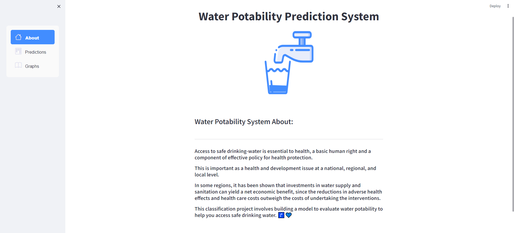
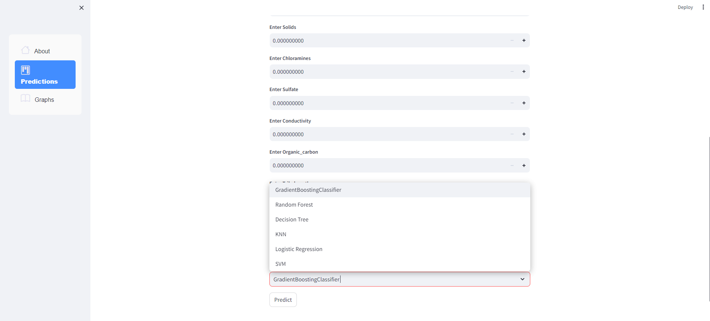
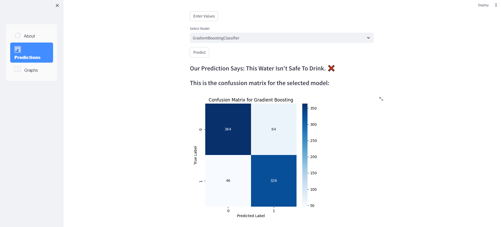
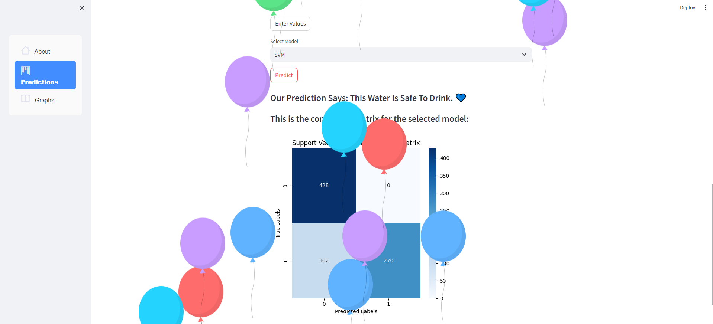
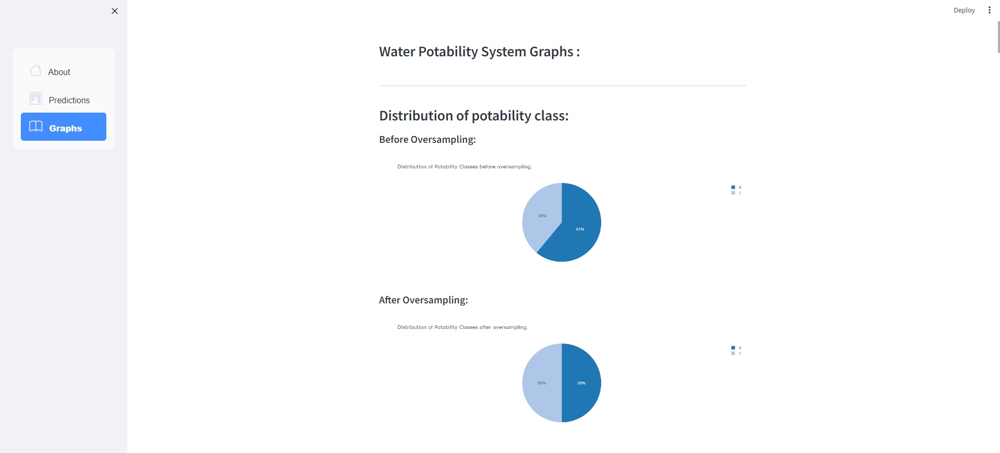
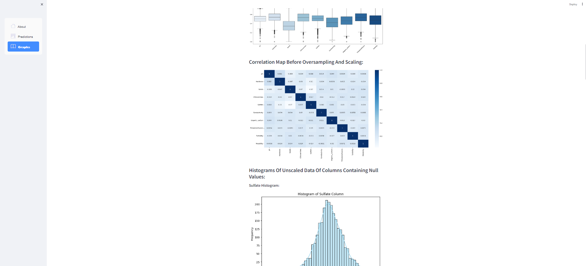
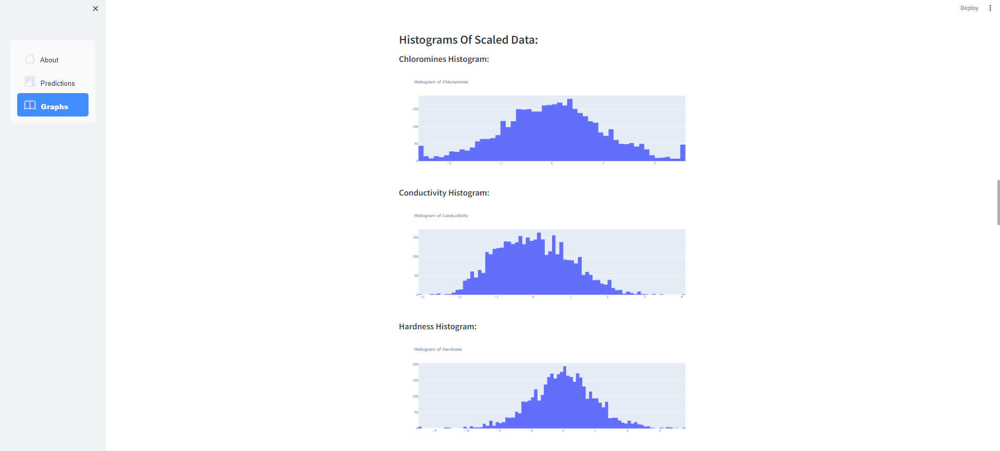

# Water Potability Prediction System 🚰
### 🔹Overview
#### Access to safe drinking water is essential to health, a basic human right, and a component of effective policy for health protection. This is important as a health and development issue at a national, regional, and local level. In some regions, it has been shown that investments in water supply and sanitation can yield a net economic benefit since the reductions in adverse health effects and healthcare costs outweigh the costs of undertaking the interventions. This Potability Prediction System project involves building models to evaluate water potability to help you access safe drinking water. 

#### Water Potability Prediction System is an Artificial intelligence (AI) project developed by Team 8 at [Faculty of Computer and Information Science - ASU](https://cis.asu.edu.eg/).

### 🔹Welcome Screen
#### This screen has a brief description of our project.

### 🔹Predictions Screen

#### You enter the numeric values of each feature as indicated in the Predictions Screen above.
Those values are then passed to a model of your choice from the provided six models:
* Support vector machine (SVM).
* Decision tree.
* Random forest.
* Gradient boosting.
* K-nearest neighbor (KNN).
* Logistic regression.
All of which are classification models.

#### Then the selected model predicts whether your water is safe to drink or not, and also displays the confusion matrix of the selected model.

### 🔹Graphs Screen
#### This screen has a list of graphs from our project's notebook.

